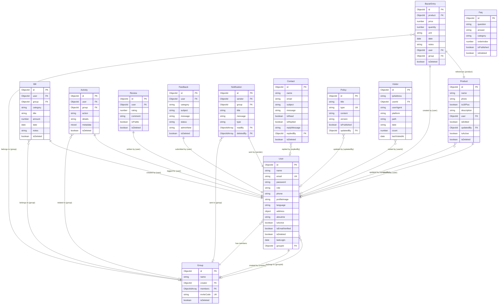

# Bazar Hisab - Backend API

<div align="center">
  
  
  
  [](https://nodejs.org/)
  [](https://www.typescriptlang.org/)
  [](https://expressjs.com/)
  [](https://www.mongodb.com/)
  [](#)
  [](LICENSE.md)
  
</div>

---

## 🌟 Overview

**Bazar Hisab** is a state-of-the-art backend REST API designed for shared household/roommate budgeting, grocery expense tracking, and utility billing calculations. It enables groups of users (e.g. partners, families, flatmates) to log daily grocery expenditures, track monthly bill payments (like house rent, wifi, electricity, travel), analyze price trend fluctuations, and moderate community testimonials.

---

## 🛠️ Tech Stack

- **Core Runtime**: Node.js & Express
- **Language**: TypeScript (Type-safe compilation)
- **Database**: MongoDB (Mongoose Object Modeling)
- **Security**: JSON Web Token (JWT) Authentication & Bcrypt hashing
- **Mail Service**: SMTP Nodemailer integrations with premium responsive HTML templates
- **Code Quality**: Prettier, ESLint, and strict Type configurations

---

## 🚀 Key Features

### 👥 Partner & Group Management
- **Group Shared Ledgers**: Link accounts (e.g., husband and wife) using unique auto-generated invite codes to calculate calculations collectively.
- **Strict Group Bounds**: Automatically prevents groups from exceeding a maximum limit of **20 active members**.
- **User Roles**: Secured authorization checks enforcing Admin, Moderator, and Standard User roles.

### 🍎 Product & Daily Bazar Tracking
- **Global Shared Products**: Unified database of products (e.g. eggs, rice) to avoid duplicate variations and spelling mismatches.
- **Unit Standardizations**: Converts gram (`GM`) purchases to kilogram (`KG`) values automatically (scaling price per unit by 1000) for consistent reporting.

### 💵 Comprehensive Bill / Expense Module
- Log utility rents, transit fares, wifi bills, electricity, maid salaries, building maintenance, shopping, grooming, and laundry.
- Automated pagination and total calculations integrated directly.

### 📊 Rich Analytics & Graph Endpoints
- **Dual-Mode Trend Data**: Day-by-day stats for the current month (`view=monthly`) and month-by-month stats for the current year (`view=yearly`).
- **Product Price Growth Milestones**: Plots historical unit price trends for any product with **duplicate-price compression** (only plotting actual changes and latest buy values) to feed clean line charts.

### 🛡️ Moderation & Audit Logging
- Background activity tracking logs creations, updates, deletions, and mergers across all models.
- Entire Audit log protected with strict **ADMIN only** visibility filters.

### ✉️ Support & Testimonial Centers
- **Contact Submissions**: Public contact form. Admins can reply directly, triggering responsive email notifications.
- **Feedback & Reviews**: Star rating reviews that administrators can moderate to display public testimonies.

---

## 🗃️ Database Schemas & Relationships

The database is built on **MongoDB** utilizing **Mongoose** object modeling. Here is a visual overview of all collection relationships:



### Collection Schemas Summary

1. **User** (`auth.model.ts`): Stores user account details, preferences, addresses, authentication states, and their associated `groupId`.
2. **Group** (`group.model.ts`): Coordinates household roommates/partners with unique `inviteCode`s.
3. **Product** (`product.model.ts`): Holds product catalog names, descriptions, and edit history tracking.
4. **BazarEntry** (`bazar-entry.model.ts`): Tracks unit (`KG`/`GM`/`PIECE`), quantity, and price for a grocery purchase.
5. **Bill** (`bill.model.ts`): Logs utility bills such as WiFi, Rent, Electricity, and maid expenses.
6. **Activity** (`activity.model.ts`): System audit log records tracking user operations and admin activities.
7. **Review** (`review.model.ts`): Rating reviews submitted by authenticated users (limit 1 per user).
8. **Feedback** (`feedback.model.ts`): User feedback, bug reports, and feature requests.
9. **Notification** (`notification.model.ts`): In-app push feed alerts for room expense additions, bill updates, and group actions.
10. **Contact** (`contact.model.ts`): Form submissions with support queries and admin email replies.
11. **Policy** (`policy.model.ts`): Dynamic website policies (Terms of Service, Privacy Policy).
12. **Faq** (`faq.model.ts`): Managed frequently asked questions & answers catalog.
13. **Visitor** (`visitor.model.ts`): Unique traffic hit counts by IP address, user agent, and platform (WEB/ANDROID/IOS).

---

## 📂 Project Structure

```text
src/
├── app/
│   ├── config/             # Config variables & environment parsers
│   ├── middlewares/        # Authentication, role validation, error handlers
│   ├── modules/            # Domain-driven features (Controller, Route, Service, Model)
│   │   ├── auth/           # Registration, login, profile, deactivation
│   │   ├── user/           # Admin user management & account control
│   │   ├── product/        # Global product catalog & merge tools
│   │   ├── bazar-entry/    # Daily grocery entries
│   │   ├── bill/           # Utilities, rent, wifi, mobile bills
│   │   ├── group/          # Create, join, and manage household partners
│   │   ├── dashboard/      # Admin stats, monthly trends, price growth
│   │   ├── activity/       # Admin audit logs
│   │   ├── contact/        # Contact forms & support replies
│   │   ├── feedback/       # Feedback & bug reports
│   │   ├── review/         # Star rating reviews & user review status
│   │   ├── notification/   # User notification feeds & unread counts
│   │   ├── visitor/        # Visitor analytics & platform metrics
│   │   ├── policy/         # Terms of Service & Privacy Policy management
│   │   └── faq/            # Frequently Asked Questions management
│   └── routes/             # Unified route registry index
├── errors/                 # Global ApiError utilities
├── utils/                  # Nodemailer, email templates, response structures
└── server.ts               # Express bootstrapping & Mongoose connections
```

---

## 🛣️ API Endpoints Reference

### 🔐 Authentication (`/api/v1/auth`)
| Method | Path | Access | Description |
| :--- | :--- | :--- | :--- |
| `POST` | `/auth/register` | Public | Register a new user |
| `POST` | `/auth/login` | Public | Login to account (returns JWT token) |
| `POST` | `/auth/forgot-password` | Public | Send password reset OTP |
| `POST` | `/auth/verify-otp` | Public | Verify OTP code |
| `POST` | `/auth/reset-password` | Public | Reset password with verified OTP |
| `PATCH` | `/auth/update-profile` | Private | Update logged user info |
| `DELETE`| `/auth/deactivate` | Private | Soft-delete own account |

### 👑 User Management (`/api/v1/users`)
| Method | Path | Access | Description |
| :--- | :--- | :--- | :--- |
| `GET` | `/users` | **Admin** | Query all users (supports page, limit, search & role filters) |
| `GET` | `/users/:id` | **Admin** | Fetch detailed user profile & overall activity summary |
| `GET` | `/users/:id/reviews` | **Admin** | Get all reviews submitted by specific user |
| `GET` | `/users/:id/activities` | **Admin** | Get audit activity logs for specific user |
| `GET` | `/users/:id/products` | **Admin** | Get product catalog items created by user |
| `GET` | `/users/:id/bazar-entries` | **Admin** | Get grocery purchase entries for user |
| `GET` | `/users/:id/bills` | **Admin** | Get utility bill records logged by user |
| `PATCH` | `/users/:id/status` | **Admin** | Toggle user status (Active vs Suspended) |
| `PATCH` | `/users/:id/role` | **Admin** | Toggle user role (`ADMIN` vs `USER`) |
| `DELETE`| `/users/:id` | **Admin** | Soft delete user account |

### 👥 Groups (`/api/v1/groups`)
| Method | Path | Access | Description |
| :--- | :--- | :--- | :--- |
| `POST` | `/groups` | Private | Create a new partner group |
| `POST` | `/groups/join` | Private | Join an existing group using invite code |
| `DELETE`| `/groups/leave` | Private | Leave current group |
| `GET` | `/groups/my-group` | Private | Get current group details & members list |

### 🍎 Products (`/api/v1/products`)
| Method | Path | Access | Description |
| :--- | :--- | :--- | :--- |
| `POST` | `/products` | Private | Create a global product catalog item |
| `GET` | `/products` | Private | Query products (supports pagination & search) |
| `POST` | `/products/merge` | **Admin** | Merge duplicate source product into target product |
| `PATCH` | `/products/:id` | Private | Update product details |
| `DELETE`| `/products/:id` | Private | Delete product |

### 🛒 Bazar Entries (`/api/v1/bazar-entries`)
| Method | Path | Access | Description |
| :--- | :--- | :--- | :--- |
| `POST` | `/bazar-entries` | Private | Log a daily grocery bazar purchase |
| `GET` | `/bazar-entries` | Private | Query bazar history (supports pagination & date filter) |
| `GET` | `/bazar-entries/:id` | Private | Fetch details of a specific entry |
| `PATCH` | `/bazar-entries/:id` | Private | Update bazar purchase details |
| `DELETE`| `/bazar-entries/:id` | Private | Delete bazar entry |

### 💳 Bills & Expenses (`/api/v1/bills`)
| Method | Path | Access | Description |
| :--- | :--- | :--- | :--- |
| `POST` | `/bills` | Private | Log a utility bill (rent, wifi, electricity, etc.) |
| `GET` | `/bills` | Private | Fetch bills feed (filters by category, date, page) |
| `GET` | `/bills/:id` | Private | View specific bill details |
| `PATCH` | `/bills/:id` | Private | Edit a bill record |
| `DELETE`| `/bills/:id` | Private | Delete a bill record |

### 📊 Dashboard & Trend Graphs (`/api/v1/dashboard`)
| Method | Path | Access | Description |
| :--- | :--- | :--- | :--- |
| `GET` | `/dashboard/admin-stats` | **Admin** | System aggregates (users, groups, average costs) |
| `GET` | `/dashboard/user-stats` | Private | Current/previous month and year stats comparisons |
| `GET` | `/dashboard/monthly-trend` | Private | Monthly trend values (`view=yearly` / `view=monthly`) |
| `GET` | `/dashboard/product-price-growth/:productId` | Private | Chronological deduplicated unit price graph history |

### 🛡️ Admin Audit Logs (`/api/v1/activities`)
| Method | Path | Access | Description |
| :--- | :--- | :--- | :--- |
| `GET` | `/activities` | **Admin** | View system audit activity log (paginated) |
| `DELETE`| `/activities` | **Admin** | Clear all activity history |
| `DELETE`| `/activities/:id` | **Admin** | Delete a single log item |

### ✉️ Contact Submissions (`/api/v1/contacts`)
| Method | Path | Access | Description |
| :--- | :--- | :--- | :--- |
| `POST` | `/contacts` | Public | Submit message through site contact form |
| `GET` | `/contacts` | **Admin** | List all user contact messages (paginated) |
| `GET` | `/contacts/:id` | **Admin** | View message details |
| `PATCH` | `/contacts/:id/reply` | **Admin** | Dispatch reply email to user |
| `DELETE`| `/contacts/:id` | **Admin** | Delete support message |

### 💬 Feedback (`/api/v1/feedbacks`)
| Method | Path | Access | Description |
| :--- | :--- | :--- | :--- |
| `POST` | `/feedbacks` | Private | Submit general feedback, bug report, or feature request |
| `GET` | `/feedbacks` | **Admin** | List all user feedbacks (paginated) |
| `PATCH` | `/feedbacks/:id/status` | **Admin** | Update feedback status (PENDING / IN_REVIEW / RESOLVED) |
| `DELETE`| `/feedbacks/:id` | **Admin** | Delete feedback entry |

### ⭐ Reviews (`/api/v1/reviews`)
| Method | Path | Access | Description |
| :--- | :--- | :--- | :--- |
| `POST` | `/reviews` | Private | Post a rating review & comment |
| `GET` | `/reviews/summary` | Public | Get aggregate rating statistics & star breakdown |
| `GET` | `/reviews/me` | Private | Get user review status (`hasReviewed`, `canReview`, `review`) |
| `GET` | `/reviews` | Optional Auth | List reviews (Public sees approved; Admin sees all) |
| `PATCH` | `/reviews/:id/toggle-public` | **Admin** | Approve/hide review on landing page |
| `DELETE`| `/reviews/:id` | Private | Delete review entry |

### 🔔 Notifications (`/api/v1/notifications`)
| Method | Path | Access | Description |
| :--- | :--- | :--- | :--- |
| `GET` | `/notifications` | Private | Fetch logged user's notification feed |
| `GET` | `/notifications/unread-count` | Private | Fetch unread notifications count |
| `PATCH` | `/notifications/mark-all-read` | Private | Mark all notifications as read |
| `DELETE`| `/notifications` | Private | Clear all user notifications |
| `DELETE`| `/notifications/:id` | Private | Delete a single notification item |

### 🌐 Visitor Analytics (`/api/v1/visitors`)
| Method | Path | Access | Description |
| :--- | :--- | :--- | :--- |
| `POST` | `/visitors/track` | Public | Record visitor traffic (IP address, platform, user agent) |
| `GET` | `/visitors/stats` | **Admin** | Get total visits & platform metrics breakdowns |
| `GET` | `/visitors` | **Admin** | Fetch paginated visitor logs |

### 📜 Policies & Terms (`/api/v1/policies`)
| Method | Path | Access | Description |
| :--- | :--- | :--- | :--- |
| `GET` | `/policies` | Public | Fetch published policies (Privacy Policy, Terms of Service) |
| `POST` | `/policies` | **Admin** | Create or update site policy document |
| `PATCH` | `/policies/:id` | **Admin** | Update policy content |
| `DELETE`| `/policies/:id` | **Admin** | Delete policy document |

### ❓ FAQs (`/api/v1/faqs`)
| Method | Path | Access | Description |
| :--- | :--- | :--- | :--- |
| `GET` | `/faqs` | Public | Fetch published frequently asked questions list |
| `POST` | `/faqs` | **Admin** | Create new FAQ entry |
| `PATCH` | `/faqs/:id` | **Admin** | Update FAQ question/answer details |
| `DELETE`| `/faqs/:id` | **Admin** | Delete FAQ item |

---

## ⚙️ Installation & Running Locally

1. Clone the repository and navigate into it:
   ```bash
   cd bazarhisab-backend
   ```
2. Install the node dependencies:
   ```bash
   npm install
   ```
3. Set up environment variables inside `.env` (refer to `.env.example`):
   ```ini
   NODE_ENV=development
   PORT=5000
   MONGODB_URL=mongodb://localhost:27017/bazarhisab
   BCRYPT_SALT_ROUNDS=12
   CLIENT_URL=http://localhost:3000
   JWT_ACCESS_SECRET=your_access_secret_key
   JWT_ACCESS_EXPIRE=30d
   JWT_REFRESH_SECRET=your_refresh_secret_key
   JWT_REFRESH_EXPIRE=365d
   JWT_PASSWORD_RESET_SECRET=your_password_reset_secret_key
   SMTP_HOST=smtp.mailtrap.io
   SMTP_PORT=2525
   SMTP_SECURE=false
   SMTP_USER=your_smtp_username
   SMTP_PASS=your_smtp_password
   SUPERADMINEMAIL=admin@bazarhisab.com
   SUPERADMINPASSWORD=adminpassword123
   ```
4. Run the application:
   - **For Development** (with hot-reloading using `ts-node-dev`, no build required):
     ```bash
     npm run dev
     ```
   - **For Production** (compile TypeScript and start the Node process):
     ```bash
     npm run build
     npm start
     ```

---

## 📝 License

Distributed under the MIT License. See [LICENSE.md](LICENSE.md) for more information.
